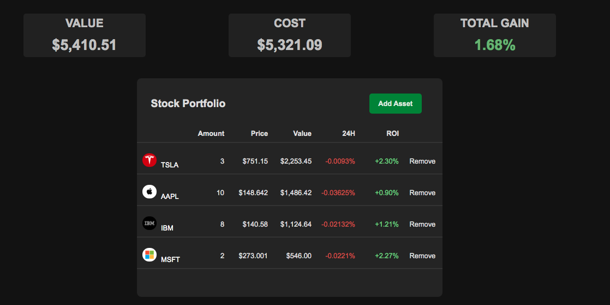
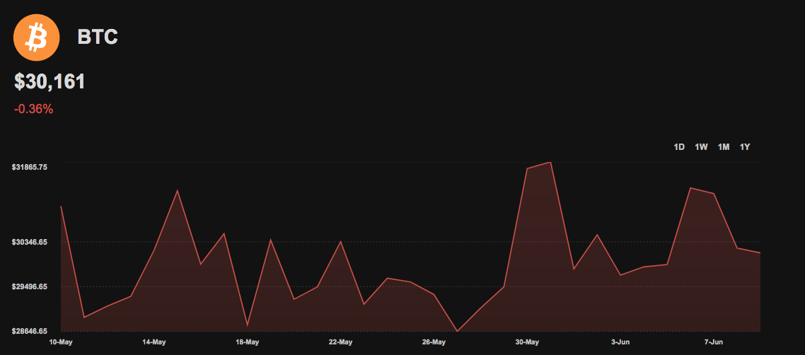
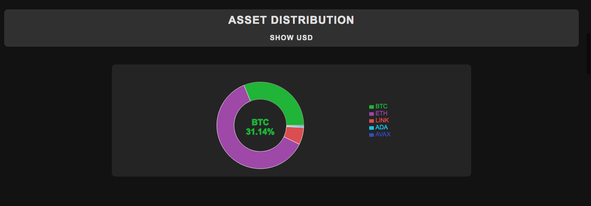
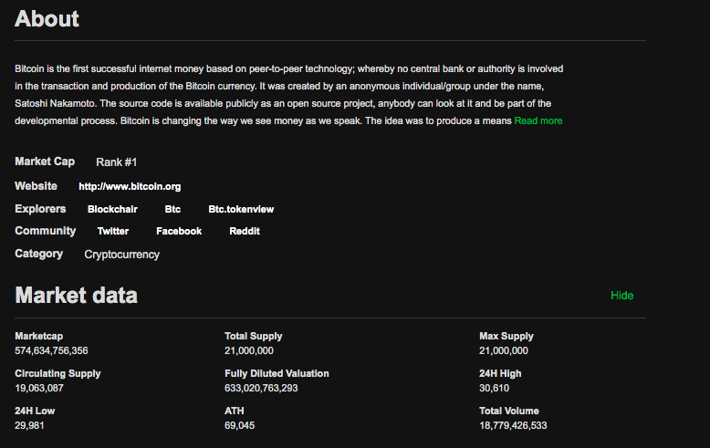
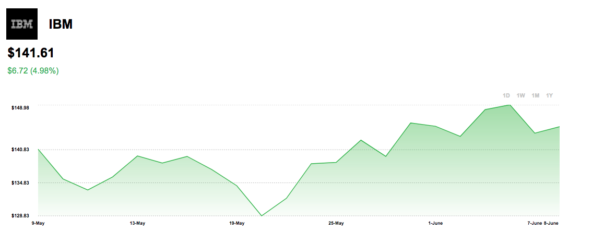

# Alpha Investment Tracker
https://asset-tracker.onrender.com
 
 

 
A full-stack web application to track stock and crypto investments.
 
Inspired by other asset trackers like Delta and FTX (Blockfolio).
 
 
<b>Features:</b>

* Buy and sell stocks/cryptocurrency
* Track profits/losses
* View price changes at different time intervals
* View company, market, and financial statement data
* Read market news
* Dark/light mode
 

